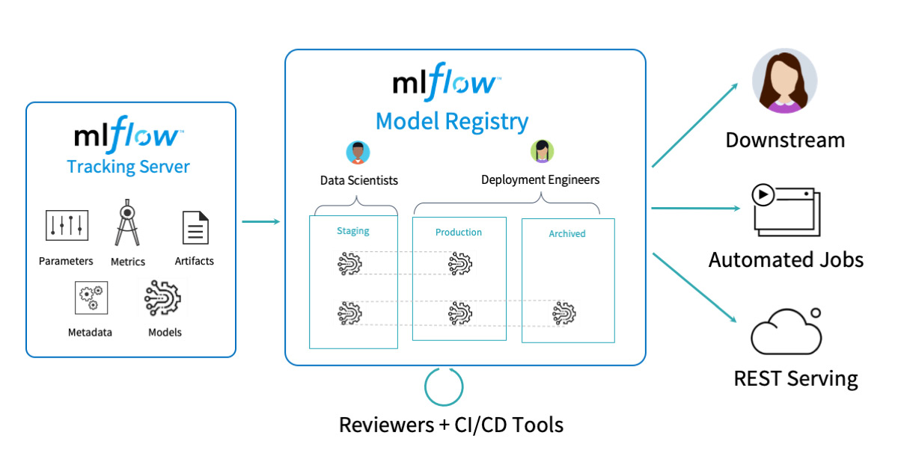
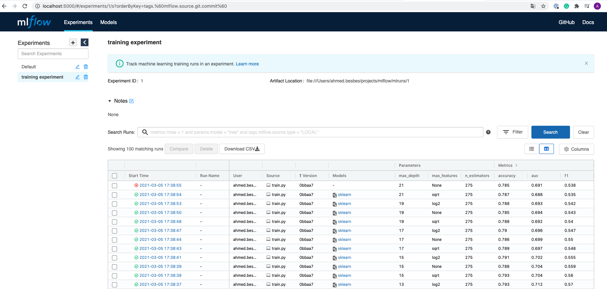
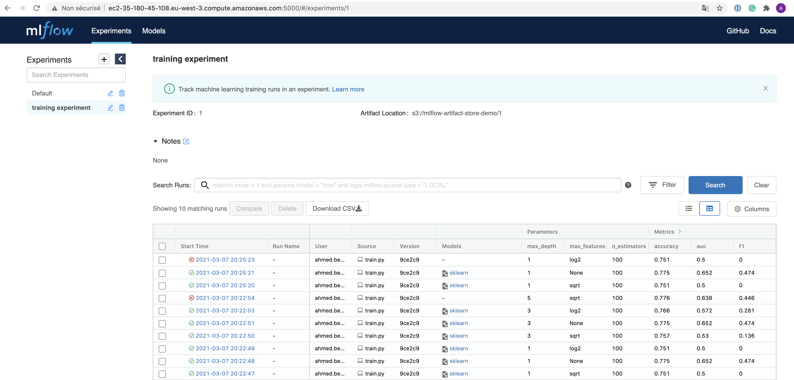
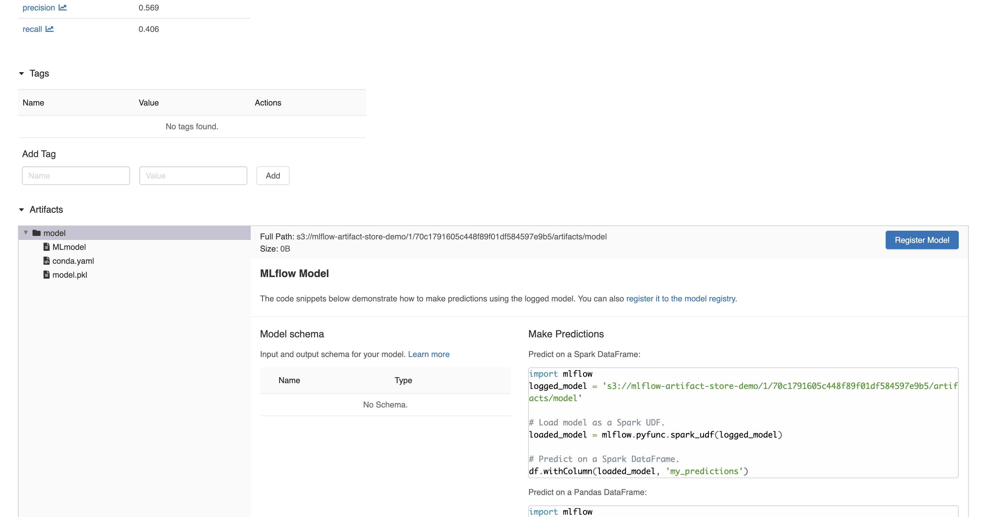
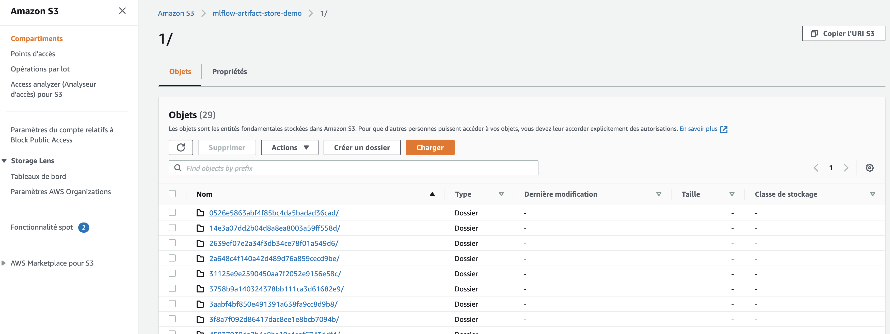

<h2 align="center">
<p>MLflow y el ciclo de vida del aprendizaje automático ♼</p>
</h2>



Este repositorio se basó en este [tutorial](https://youtu.be/osYRsBVId-A). Aquí experimentaremos con MLflow para:

- realizar un seguimiento de los experimentos de aprendizaje automático basados en:

   - métricas
   - hiperparámetros
   - scripts de ejecución
   - versionamiento del código
   - notas y comentarios

- comparar diferentes ejecuciones entre sí
- configurar un servidor de seguimiento localmente y en AWS
- implementar su modelo usando MLflow Models

### Inicio rápido localmente

Para ejecutar el código:

- Instale pipenv para ejecutar un entorno virtual con mlflow (es más limpio de esta manera)

```bash
pip install pipenv
```

- Clone este repositorio, posicionece en la carpeta

```bash
git clone https://github.com/AcecomFCUNI/Topicos-IA.git
cd Despliegue-de-modelos/Mlflow
```

- Instalar las dependencias

```bash
cd mlflow/
pipenv install .
```

- Inicie un servidor de seguimiento localmente

```bash
mlflow ui
```

- Inicie el entrenamiento (o cualquier código que se registre en MLflow)

```bash
python train.py
```

- Visite http://localhost:5000 para comprobar las ejecuciones en la interfaz de usuario de MLflow



### Lanzar un servidor de tracking en AWS

Si formas parte de un equipo de desarrolladores o científicos de datos, puedes poner en marcha un servidor de seguimiento donde todos registran sus ejecuciones.

#### 1. Prepare una máquina EC2 y un bucket S3

- cree un usuario de IAM en AWS. Obtenga sus credenciales, llamados, `Access key ID` y `Secret access key`

- con este mismo usuario, cree un depósito s3 para almacenar artefactos futuros: asigne un nombre a este depósito.
   El mío es `mlflow-artifact-store-demo` pero no puedes elegirlo

- Lance una instancia EC2: no tiene por qué ser grande. un `t2.micro` elegible para el nivel gratuito hace perfectamente el trabajo

- Configure el grupo de seguridad de esta instancia para aceptar el tráfico **http** entrante en el puerto 5000

- ssh en tu máquina EC2:

  - instale pip
    ```bash
    sudo apt update
    sudo apt install python3-pip
    ```
  - instale pipenv

    ```bash
    sudo pip3 install pipenv
    sudo pip3 install virtualenv

    export PATH=$PATH:/home/[your_user]/.local/bin/
    ```

- Ahora crea la carpeta de su nuevo entorno. Dentro de la carpeta, instale las siguientes dependencias:

  ```bash
  pipenv install mlflow
  pipenv install awscli
  pipenv install boto3
  ```

- Active su entorno con `pipenv shell`

- en la máquina EC2, configure aws con credenciales de usuario para que el servidor de seguimiento pueda tener acceso a s3 y mostrar los artefactos en la interfaz de usuario.

  Desde consola ingrese en `aws configure`, luego siga las instrucciones para ingresar las credenciales

- iniciar un servidor mlflow en la instancia EC2 definiendo el host como `0.0.0.0` y el `--default-artifact-root` como el bucket S3

  ```shell
  mlflow server -h 0.0.0.0  \
                --default-artifact-root s3://mlflow-artifact-store-demo
  ```

#### 2. Establezca las credenciales de AWS y cambie el URI de seguimiento

- establecer las credenciales de AWS como variables de entorno para que el código cargue artefactos en el bucket s3

  ```shell
  export AWS_ACCESS_KEY_ID=<your-aws-access-key-id>
  export AWS_SECRET_ACCESS_KEY = <your-aws-secret-access-key>
  ```

- debe cambiar el URI de seguimiento al **dns** público de su máquina EC2 + puerto 5000

  En mi caso, el URI de seguimiento fue: http://ec2-35-180-45-108.eu-west-3.compute.amazonaws.com:5000/

Ahora todo debería estar bien: después de ejecutar el script localmente, puede inspeccionar las métricas en la interfaz de usuario que se ejecutan en el servidor remoto



Al hacer clic en una ejecución específica, puede ver sus artefactos cargados en S3.



De hecho, estos artefactos están efectivamente en S3.



### Diapositivas

- Versión [español](other/MLflow-ES.pdf)

