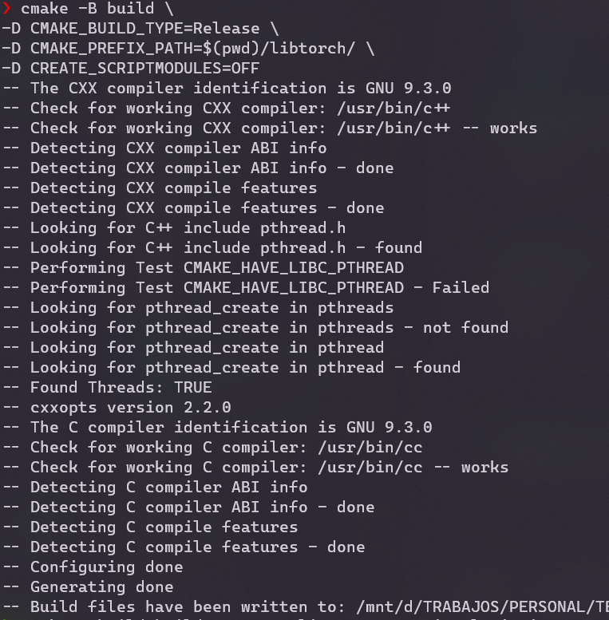
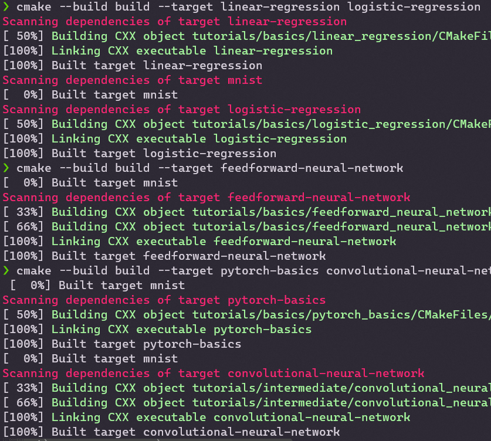

<h1 align="center">
    
</h1>
<p align="center">
    PyTorch en C++ 
    <br />


</p>


## Tabla de Contenido

Este repositorio se basó el trabajo de [Omkar Prabhu](https://github.com/prabhuomkar/pytorch-cpp). Aquí encontrarás tutoriales en C++ para los *curiosos* del aprendizaje profundo que les gusta PyTorch 🔥❤.

### 1. Básico
* [Introducción a PyTorch](tutorials/basics/pytorch_basics/main.cpp)
* [Regresión Lineal](tutorials/basics/linear_regression/main.cpp)
* [Regresión Logística](tutorials/basics/logistic_regression/main.cpp)
* [Red Neuronal Feed-forward](tutorials/basics/feedforward_neural_network/src/main.cpp)

### 2. Intermedio
* [Redes Neuronales Convolucionales](tutorials/intermediate/convolutional_neural_network/src/main.cpp)

# Ajustes iniciales

## Requerimientos

1. [C++](http://www.cplusplus.com/doc/tutorial/introduction/)
2. [CMake](https://cmake.org/download/) (versión mínima 3.14)
3. [LibTorch v1.7.0](https://pytorch.org/cppdocs/installing.html)


## Clona, compila y ejecuta los tutoriales
### En Google Colab
[](https://colab.research.google.com/github/prabhuomkar/pytorch-cpp/blob/master/notebooks/pytorch_cpp_colab_notebook.ipynb)

### En tu máquina local

```bash
git clone https://github.com/AcecomFCUNI/Topicos-IA.git
cd Despliegue-de-modelos/Pytorch-cpp
```

#### Generamos el sistema de compilación

```bash
cmake -B build #<opciones>
```


Algunas opciones útiles:

| Opción       | Defecto           | Descripción  |
| :------------- |:------------|-----:|
| `-D CUDA_V=(9.2 [Linux only]\|10.1\|10.2\|11.0\|none)`     | `none` | Descargue LibTorch para una versión CUDA (`none` = descargar la versión de la CPU). |
| `-D DOWNLOAD_DATASETS=(OFF\|ON)`     | `ON`      |   Descargue los conjuntos de datos necesarios durante la compilación (solo si aún no existen en `/data`). |
|`-D CREATE_SCRIPTMODULES=(OFF\|ON)` | `OFF` | Cree todos los archivos de módulo de script necesarios para modelos/pesos previamente aprendidos durante la compilación. Requiere python3 instalado con pytorch y torchvision. |
| `-D CMAKE_PREFIX_PATH=path/to/libtorch/share/cmake/Torch` |   `<empty>`    |    Omita la descarga de LibTorch y use su propia versión local (ver [Requerimientos](#requerimientos)). |
| `-D CMAKE_BUILD_TYPE=(Release\|Debug)` | `<empty>` (`Release` cuando se descarga LibTorch en Windows) | Establecer el tipo de compilación (`Release` = compilar con optimizaciones).|

*Nota*: Para usar su propia versión de Libtorch, en su entorno ejecute 
```python
import torch
print(torch.utils.cmake_prefix_path)
```
Para obtener la ruta necesaria para `CMAKE_PREFIX_PATH`.

<details>
<summary><b>Ejemplo Linux</b></summary>

#### Comando
```bash
cmake -B build \
-D CMAKE_BUILD_TYPE=Release \
-D CMAKE_PREFIX_PATH=$(pwd)/libtorch/ \
-D CREATE_SCRIPTMODULES=OFF 
```
Obtendrá una salida similar a la siguiente
<h1 align="center">
    
</h1>

</details>

### Todos los tutoriales
Para crear todos los tutoriales, use
```bash
cmake --build build
```

### Todos los tutoriales en una categoría
Puede elegir crear tutoriales solo en una de las categorías `basics` e `intermediate`. Por ejemplo:
```bash
cmake --build build --target basics
# En general: cmake --build build --target {category}
```

### Tutorial único
También puede optar por crear un solo tutorial. Por ejemplo, para crear solo el tutorial del `linear regression`:
```bash
cmake --build build --target linear-regression
# En general: cmake --build build --target {tutorial-name}
# cmake --build build --target feedforward-neural-network
# cmake --build build --target pytorch-basics
# cmake --build build --target convolutional-neural-network
```
>**_Nota_**:  
> El argumento de destino es el nombre de la carpeta de tutoriales con todos los guiones bajos reemplazados por guiones normales.

>**_Sugerencia para usuarios de la versión CMake >= 3.15_**:  
> Puede especificar varios objetivos separados por espacios, por ejemplo:  
> ```bash 
> cmake --build build --target linear-regression logistic-regression
> ```

Obtendremos una salida similar a
<h1 align="center">
    
</h1>

### Ejecutar tutoriales

1. (**IMPORTANTE!**) Primero cambie al directorio del tutorial dentro de `build/tutorials`. Por ejemplo, suponiendo que está en el directorio `Pytorch-cpp` y desea cambiar a la carpeta del tutorial básico de pytorch:
     ```bash
     cd build/tutorials/basics/pytorch_basics
     # En general: cd build/tutorials/{basics|intermediate}/{tutorial_name}
     ```
2. Corra el ejecutable. Tenga en cuenta que el nombre del ejecutable es el nombre de la carpeta de tutoriales con todos los guiones bajos reemplazados por guiones (por ejemplo, para la carpeta de tutoriales: `pytorch_basics` -> nombre del ejecutable: `pytorch-basics` (o `pytorch-basics.exe` en Windows)). Por ejemplo, para ejecutar el tutorial básico de pytorch:<br><br>
     **Linux/Mac**
     ```bash
     ./pytorch-basics
     # En general: ./{tutorial-name}
     ```
     **Windows**
     ```powershell
     .\pytorch-basics.exe
     # En general: .\{tutorial-name}.exe
     ```
