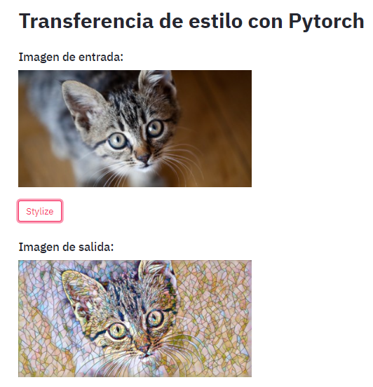

# Transferencia de estilo con Pytorch 🖼️ 🔥 
En este tutorial se ha construido una app DL que aplica transferencia de estilo a las imágenes.

## Preview
<p align="center">
  
</p>
  
## Referencias
Me he basado en los siguientes materiales:
- [Fast Neural Style](https://github.com/pytorch/examples/tree/master/fast_neural_style)

- [Streamlit website](https://www.streamlit.io/)

Y en especial de este [videotutorial](https://youtu.be/M3lZNbFJ6I0)

## Instalación
Instale las siguientes dependencias
```console
pip install streamlit
pip install torch torchvision
```

## Uso
Descargue los modelos preentrenados y coloquelos en la carpeta `neural_style`.
```console
python download_saved_models.py
```

Finalemente ejecute
```console
streamlit run main.py
```