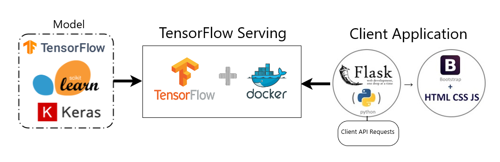

<h2 align="center">
<p>Sirviendo modelos con TensorFlow Serving 🚀</p>
</h2>

Tensorflow Serving permite desplegar proyectos de ML/DL con mucha facilidad. Proporciona un `end-point` al cual podemos acceder desde cualquier aplicación. A continuación se muestra un pipeline del proceso de despliegue mediante Tensorflow Serving y Docker.
<p align="center">
    <br>
    
    </a>
    <br>
</p>

Primero instalemos la imagen Docker
```console
docker pull tensorflow/serving
```

Eliminemos otros contenedores con el mismo nombre
```console
docker container rm <container_id> 
```

Desde el terminal de linux, ejecute el siguiente comando
```console
docker run --name=tfserving_classifier -p 8501:8501 -it -v "$(pwd)/img_classifier:/models/img_classifier"  -e MODEL_NAME=img_classifier tensorflow/serving
```
Ahora podemos ejecutar `predict.py` desde otro terminal y obsersar como obtenemos nuestras predicciones con una baja latencia. Diviértete 😁!