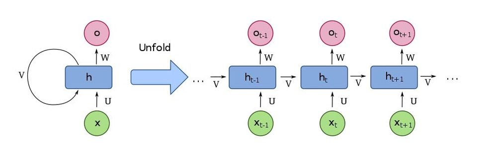

# Generando nombres a nivel de carácteres con RNN's

<br/>
<p align="center">
  <code></code>
  <code></code>
</p>
<br/>


#### Uso
```
python train.py
python predict.py char-rnn-generation9.pt
```

#### Algunos resultados (beam tamaño 3)
```
====== Irish
O'Dell -0.6350323756535848
O'Brian -0.6820564951215472
O'Brien -0.6878840582711356
====== Italian
Albero -0.9236377875010172
Alberigo -0.8406117558479309
Alberighi -0.6255239380730523
====== Scottish
Watson -0.5849217971165975
Walker -0.623577872912089
Sutherland -0.4097114562988281
====== Korean
Son -1.195298433303833
Shin -0.8101678490638733
Choe -1.0431489944458008
====== English
Keeley -1.2196478048960369
Hellan -1.322618802388509
Keeling -1.1574227469308036
====== Arabic
Samaha -0.5359944899876913
Haddad -0.6641473372777303
Shamoon -0.670792715890067
```

